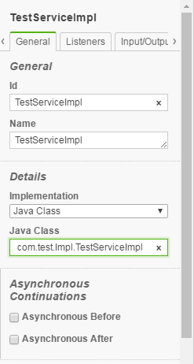
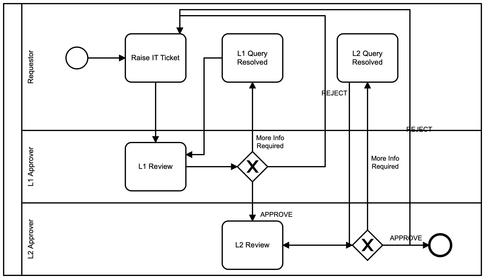
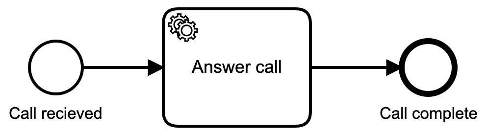
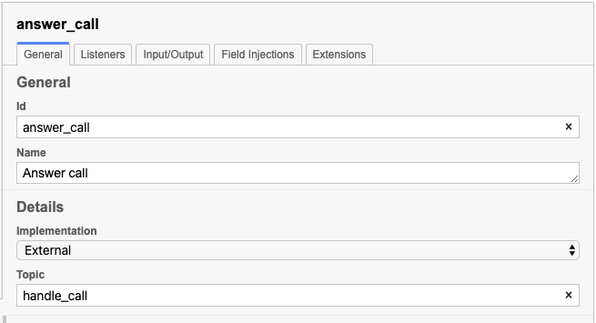

# 20 Popular Camunda Questions

Recently we were asked an intereting question: What are the 20 most popular questions about Camunda Platform BPMN? And you know, we never really thoguht about it, so we decided to.

First problem was to figure out how to determine what the "popular" questions were. The first thing to do, or course was head over to the [forums](https://forum.camunda.org) and do some sleuthing, but that's not the only way to ask questions. So we checked in with the [Question Corner](https://page.camunda.com/wb-camunda-question-corner) as well to see what was popular over there.

So, now that we had a list of what we thought were the 20 most popular questions, it's time to bring all the answers together! These questions are not an ordered list, just a collection.

## Question 1
**Reading from the application.properties file**: We see this question, in a variety of forms, quite a bit so, even though it is referenced in the [documentation](https://docs.camunda.org/manual/7.14/user-guide/process-engine/delegation-code/) there are still often questions about it.

But in that document, the important bits are:
> To implement a class that can be called during process execution, this class needs to implement the org.camunda.bpm.engine.delegate.JavaDelegate interface and provide the required logic in the execute method. When process execution arrives at this particular step, it will execute this logic defined in that method and leave the activity in the default BPMN 2.0 way.
> ...
> The classes that are referenced in the process definition (i.e., by using camunda:class ) are NOT instantiated during deployment. Only when a process execution arrives at the point in the process where the class is used for the first time, an instance of that class will be created. If the class cannot be found, a ProcessEngineException will be thrown. The reason for this is that the environment (and more specifically the classpath) when you are deploying is often different than the actual runtime environment.

That last part is especially important in that you won't see a potential problem (`Exception`) until the first time the process is run and that class is called. In other words, a successful deployment is not evidence enough that there isn't a problem. You will need to have the process run in order to ensure that there won't be a classpath problem in your runtime environment.

But wait, that's not got anything to do with my properties file! Well, yes and no.



If that's what your properties entry looks like, and this is what your `TestServiceImpl` class looks like

```java
public class TestServiceImpl implements JavaDelegate {

    public void execute(DelegateExecution execution) throws Exception {
      String var = (String) execution.getVariable("input");
      var = var.toUpperCase();
      execution.setVariable("input", var);
    }

}
```
You're almost there. It's just down to how you are referring to your class in the properties tab. `${TestServiceImpl}` should do the trick. But keep in mind the above caveat that you likely won't see any problem with your class being referenced until you attempt to run it.

## Question 2

**Are there better ways of modeling repetitive common tasks?**

For example, a task that is asking for ‘additional information’ required at every task can get cumbersome.

This is a great question that inevitably leads us back to some of our [best practices](https://camunda.com/best-practices/creating-readable-process-models/) for modeling. tl;dr it's better to model _everything_ and leave nothing out. It may seem like it will make your model overly-complicated and confusing but the reality is that by documenting every step in the process you end up making the model more complete, more readable and easier to understand.

Let's say this is your original model:



Yep, that's complicated alright! As you can see, there are multiple places where more information is required, but the overall flow looks complicated.

If we clean that model up using some of the best practices we can see a new model:


Yes, this model is substantially larger overall, but it's _much_ easier to read, and easier to see what is actually happening at each step.

## Question 3

**How can I check if a variable is set?**

This is an interesting question, with a couple of great answers, depending on your implementation.

First, you _could_ define a variable that gets set when the process begins, like:

```js
var MyVar
```
And then in your execution, you could have an expression that checks this variable:

```
${ MyVar != null }
```
But then you have a variable hanging around in your process that may or may not get used. Probably not the ideal solution.

If you try to use that expression without having the variable set, it will cause an exception, which is *definitely* not what you want.

The better solution here would be to change the `implementation` in the sequence flow from `expression` to `script`. Then, in the implementation box, enter a short javascript implementation:

```js
execution.getVariable('MyVar') != null
```

Which will check if the variable exists at all, and return `true` if it exists (is not `null`).

But it turns out that there is a [documented](https://docs.camunda.org/javadoc/camunda-bpm-platform/7.7/org/camunda/bpm/engine/delegate/VariableScope.html#hasVariable(java.lang.String)) `hasVariable()` call that can simplify this even more. If you're into ternary operators:

```js
(execution.hasVariable("myVar") ? execution.getVariable("myVar") : "null")
```

if you're not,

```js
if ((execution.hasVariable("myVar")) && (execution.getVariable("myVar")) == "whatever")) { .... }
```
will do the trick nicely.

I definitely recommend this last solution as it's a cleaner, more robust solution.

## Question 4

**Single sign-on in Camunda**

This is a very popular topic, and one that has about as many answers as you can dream up. Much of this depends on what you plan to use to facilitate your Single Sign On (SSO) capabilities. We can go through a couple of examples here.

First thing is to understand the Authentication method provided by Camunda. YOu can read about the [Basic Authentication](https://docs.camunda.org/manual/latest/reference/rest/overview/authentication/) method, which is what most of the solutions are based on.

You can therefore provide your own implementation, add it to the web.xml (as described in the basic auth example) and all requests should be authenticated using your implementation.

This only solves the authentication part of the issue, and Authorization details still need to be provided in Camunda itself (usernames and groups need to exist, etc.) but it is a jumping-off point.

Now, if you're looking for a more fully-complete solution, the Camunda Consulting Team has provided a complete solution using the Camunda Springboot Starter, with Springboot Security. You can find that entire project on the [Camunda Consulting](https://github.com/camunda-consulting/code/tree/master/snippets/springboot-security-sso) Github site.

Likewise there is a Camunda [JBoss SSO](https://github.com/camunda/camunda-sso-snippets) example, and a [Keycloak example](https://github.com/camunda/camunda-sso-snippets) as well.

With all these examples, combined with the [documentation](https://docs.camunda.org/manual/latest/reference/rest/overview/authentication/) you should be well on your way to implementing a custom SSO solution.

## Question 5

**An Example of completing a user task via the REST API**

This is a very common usage pattern. You have a REST client that you want to claim a task, and complete it.

The first thing is to decide if you will implement this as an `External Task` or as a straight REST call from an external application.

First, let's go through doing this as an external task. And let's take a very simple BPMN as our example:



A call comes in, and a Service Task will handle the call, and complete the task.

Next we have to define which Service Task will handle this task



Notice that we have defined the service task as an `external` implementation, and have then added a `topic` of `handle_call` for that task.

Now it's time to implement the REST calls. We're going to do this using the Go Library for Camunda. The very first thing to do is create a Camunda client with the proper URL for your Camunda instance:

```go
client := camundaclientgo.NewClient(camundaclientgo.ClientOptions{
		EndpointUrl: "https://localhost:8090/engine-rest",
		// ApiUser:     "demo",
		// ApiPassword: "demo",
		// RESET to 10
		Timeout: time.Second * 10,
	})
  ```

  Now that we have an instance, we can create a processor to handle activity:

  ```go
  proc := processor.NewProcessor(client, &processor.ProcessorOptions{
		WorkerId:                  "MyWorkerID",
		LockDuration:              time.Second * 5,
		MaxTasks:                  10,
		MaxParallelTaskPerHandler: 100,
		LongPollingTimeout:        5 * time.Second,
	}, logger)
  ```
  And finally we'll create a handler that will deal with the tasks as they arrive:
  ```go
  proc.AddHandler( // Handle the call that just came in
		&[]camundaclientgo.QueryFetchAndLockTopic{
			{TopicName: "handle_call"},
		},
		func(ctx *processor.Context) error {
			return handle_call(ctx.Task.Variables, ctx)
		},
	)
  ```
  Which that simple setup, everytime a call comes in, it will be place on the outgoing task queue wating for an external task to come claim it. the `addHandler()` function is just sitting around waiting for anything to show up on that queue, at which point it fetches the topic, and locks it so no one else can come claim it, and then calls the go methode `handle_call()`.

  That method could look something like this:

  ```go
  func handle_call(newVars map[string]camundaclientgo.Variable, contx *processor.Context) error {
	   fmt.Printf("Running task %s. WorkerId: %s. TopicName: %s\n", contx.Task.Id, contx.Task.WorkerId, contx.Task.TopicName)
	   varb := contx.Task.Variables // gets all the context variables

	callerOK := isValueInList(fmt.Sprintf("%v", varb["caller"].Value), getCallers())
	vars := make(map[string]camundaclientgo.Variable)
	vars["callerOK"] = camundaclientgo.Variable{Value: callerOK, Type: "boolean"}
	vars["status"] = camundaclientgo.Variable{Value: "true", Type: "boolean"}
	if !callerOK {
		vars["message_type"] = camundaclientgo.Variable{Value: "failure", Type: "string"}
	} else {
		vars["message_type"] = camundaclientgo.Variable{Value: "success", Type: "string"}
	}
	err := contx.Complete(processor.QueryComplete{
		Variables: &vars,
	})
	if err != nil {
		return err
	}
	return nil
}
```
This method extracts all the context variables from the process, checks the value of one, and then sets a few more before returning everything and telling the engine that the process has been completed.

One thing to be aware of is that in the call to `processor.NewProcessor()` we set a lock duration of 5 seconds. If the execution time of your external task takes longer than 5 seconds, an error will actually be thrown in the engine because the lock timed out. So be aware of how long your external process may take, and set the appropriate timeouts.

Now, let's say you don't want to do external tasks at all, but you just want to be able to do a straight REST call to grab a task. That's doable as well, but you're going to need a little more information.

First, you can set the task up as, say, a `user task` instead of an `external task` as before.

Next, you would then call the REST API:

```java
String url = "http://localhost:8080/engine-rest/task/c44b7c61-5026-11e7-9d74-064bed1e2b33/complete";
    	  URL obj = new URL(url);
    	  HttpURLConnection con = (HttpURLConnection) obj.openConnection();

	        // Setting basic post request
	  con.setRequestMethod("POST");
	  con.setRequestProperty("Content-Type","application/json");

//if you want to add some variables
	  String postJsonData = "{\"variables\":\r\n    {\"aVariable\": {\"value\": \"aStringValue\"},\r\n    \"anotherVariable\": {\"value\": 42},\r\n    \"aThirdVariable\": {\"value\": true}}\r\n}";

	  // Send post request
	  con.setDoOutput(true);
	  DataOutputStream wr = new DataOutputStream(con.getOutputStream());
	  wr.writeBytes(postJsonData);
	  wr.flush();
	  wr.close();

	  int responseCode = con.getResponseCode();
	  System.out.println("nSending 'POST' request to URL : " + url);
	  System.out.println("Post Data : " + postJsonData);
	  System.out.println("Response Code : " + responseCode);
```

**Note:** you **must** know the `task id` in order for this to work! You can't simply call this without a specific task id. Finding the task id is a whole other matter. Your best bet for *that* is continued in the [get tasks](https://docs.camunda.org/manual/7.13/reference/rest/task/get-query/) query.

Even with that, you will need some detailed information in order to get the list of Tasks, and find the task id you are looking for.

## Question 6

**What are the biggest advantages of Camunda BPM over custom java workflow application?**

This can be a tricky question to answer because it can be heavily dependent on your specific business process, your future plans for automating more business processes, and the level of comfort your developers have with Java, BPMN, etc. but let's go ahead and dive in anyway.

First, it might be instructive to read this [post](https://blog.bernd-ruecker.com/the-7-sins-of-workflow-b3641736bf5c) by Bernt Ruecker on a related topic. Of particular note:

> Throughout my career I saw hundreds, if not thousands of home-grown engines. It literally always happens when you start with no-engine. After a while, projects start to recognize they are missing out on something. They introduce a first small status flag in an order table. But hey, you also need a timeout if customer payments are not received in time. Let’s quickly implement this. After a while projects introduce a small XML or JSON dialect to make processes more flexible. Congratulations, you have built your own engine!
>
> All companies I know want to get rid of this engine. It is a nightmare to maintain. It is not rare to have 1–4 people working full time on this. And it will always lag behind professional engines in terms of features and maturity, especially in the fast-changing IT world.

He is not wrong. Even I've seen it happen, and I haven't worked in the word of BPMN as long as Bernt has!

If you read through [this post](https://forum.camunda.org/t/what-are-the-biggest-advantages-of-camunda-bpm-over-custom-java-workflow-application/3145/3) on the [Camunda Forums](https://forum.camunda.org/) there is a phenomenal answer to this very question that I will attempt to summarize here.

> **BPM/Case engines and long-running business-transactions**
>
> Assuming you’re looking at a BPM or Case engine/framework to help handle business-transactions. These are the potentially very long running transactions that would normally bring your traditional transaction managers to its knees. This means you wouldn’t ask your application server and/or database to keep track of and maintaining transactions (aka ACID) for some business-transaction lasting several hours or days.

While the task you are currently responsible for implementing may not necessarily be a 'long running' task, chances are fairly high that you will have fallen into the trap of implementing your own engine, and the *next* task may very well be a long-running one.

> So, very good messaging systems can handle this - true. But, you’ll seriously sacrifice BPMN modelling concepts - which are now mainstream. And, this is a very serious deal, without a representative model reflecting these long-running transaction/object instances, all their hooks, dependencies, context, and relationships, becomes a mystery. Just thinking in terms of stacking up a set of inter-dependent MQ banking/transfer contexts - how would you do this in a reasonably informative visualization w/o the aid of a BPM-engine and associated instance reporting?

It's hard to overstate how useful a visual representation of the entire task, complete with all its steps and implementation details, is after a task is implemented. Would you rather go back and have to read through all the code (which may, or, more likely may not, be well documented) or would you rather have a self-documented process model to look over? I've read through enough source-code in my career to know that I'd prefer to start with the model and only dive into the source code if I need to see the details of how a specific part of the model is implemented. (See the next section for more on this.)

> **see:** Bernstein, Philip A., and Eric Newcomer. Principles of transaction processing. Morgan Kaufmann, 2009.

> **BPMN models vs UML or Visio (informal) activity diagrams?**
>
> BPMN gives you more notation features. You could use Visio (etc). But a Visio-model diagram doesn’t provide the ability to magically visualize process instances (i.e. in-flight process).

Further, using BPMN can give you a layer of abstraction that can allow you to alter your business process as business needs change *without* having to go in and touch the underlying code. You can alter the implementation without the fear of introducing a bug into an already functioning system.

> **Operations: Configuration Management and Life-cycle**
>
> This is the “oh-darn” situation when you realize your production systems require an upgrade or patch. Camunda provides both methods and approach for managing this situation.

As with the ability to make changes to the model without making changes to the code, using an engine such as Camunda allows you to upgrade the underlying engine without fear that the upgrade may bring the whole system down due to some unforeseen incompatibility.

> **Built-in Documentation Management**
>
> Thinking of your process/case models - fully illustrated and annotated. These diagrams provide user-self-training opportunities. For example, answering the question “how do I do this business task?” Well, refer to the process-portal and browse through available model types (aka business functions).

These models can also provide you with pre-built parts with which to implement *new* models and processes. Again, without writing new code (with the inherent risk of creating bugs). Don't under-estimate the importance of reusable process building blocks as you move forward with automating more and more processes.

> **Reporting**
>
> Who loves to write reports from scratch? I prefer to get these off-the-shelf and with pre-existing hooks into business-task and process state.

With Camunda, you can have the flexibility of built-in reporting tools that you can use to generate on-demand or other reports as needed. All without writing any additional code. And every line of code you have to write yourself is a potential business liability. It creates the potential for costly bugs, it creates technical debt that must be serviced regularly, and it creates further dependencies that may break in the future.

All of these are things you want to avoid if at all possible. 

