# Q&A The one where you delete an open Human Task

How can I delete or cancel an open human task and running process instances? We've [already covered](link/to/question/8) how to delete an entire process instance, so let's dive into how to delete just a human (or other) task associated with a running process.

Cancelling a specific task, or even an open Human Task, is very similar, but let's go through it step by step just to be clear.

## Step by Step Instructions

First, as before, we need to go to Cockpit and look for the task we want to cancel.

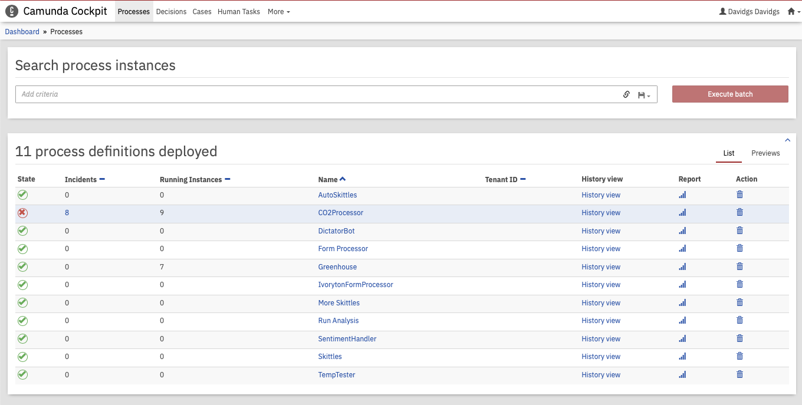

Once we've identified the running instance we want to cancel, click on that process identifier.

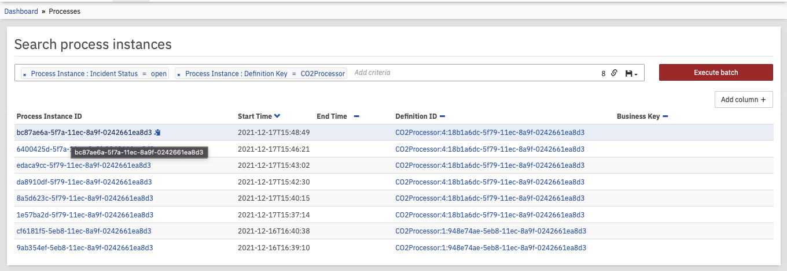

That will open up the process model, showing where the specific task is in the process.

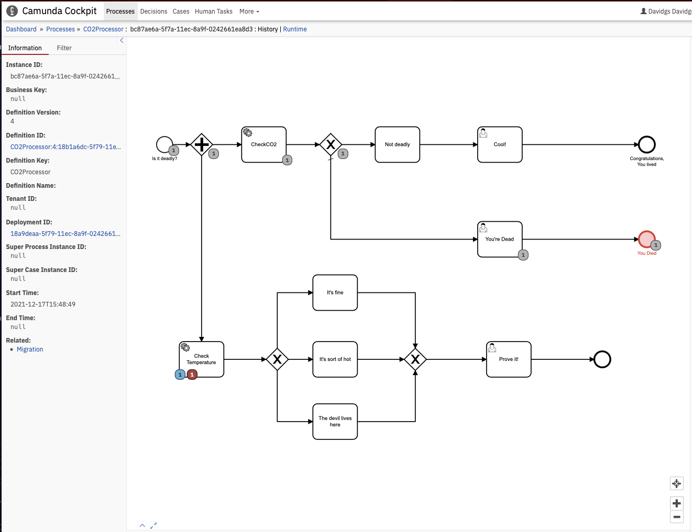

Hovering our mouse over that instance will show us a bit more information about the task or incident we are looing at.

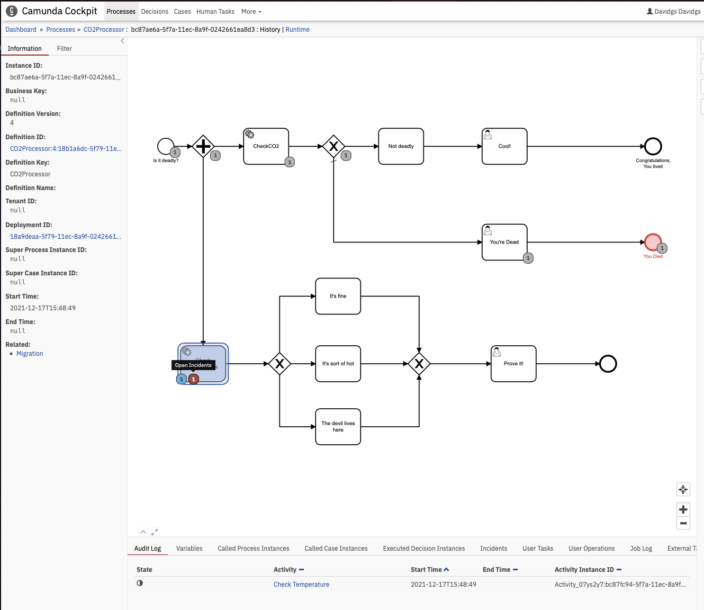

Once we are _sure_ that we have the right process task instance, we can go up to the far right corner and click on the 'Cancel' button to delete it. This will also delete any open incidents associated with that task.

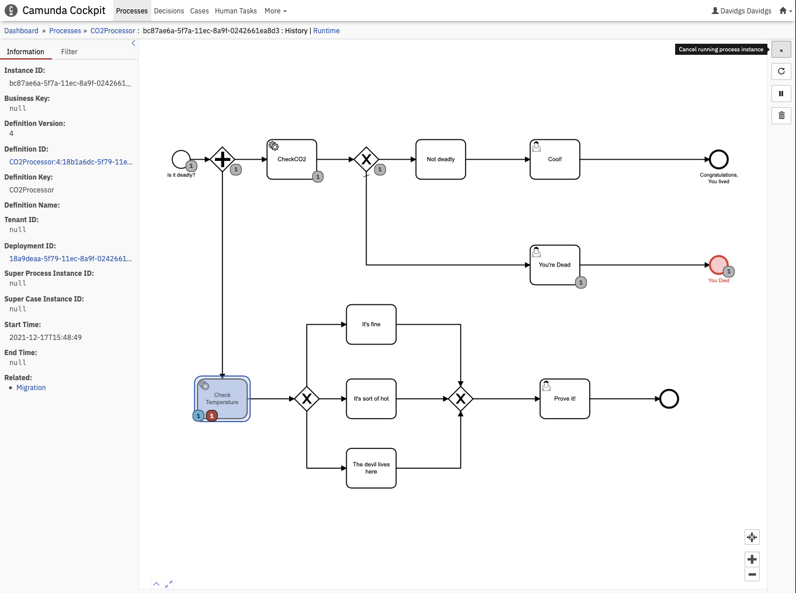

We will, of course, want to confirm that this is indeed what we want to do. So click the 'Cancel Process Instance' button to confirm.

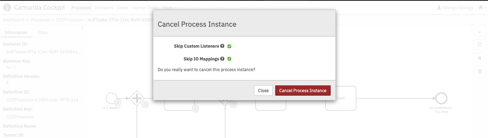

And we get confirmation that the process instance has been canceled.

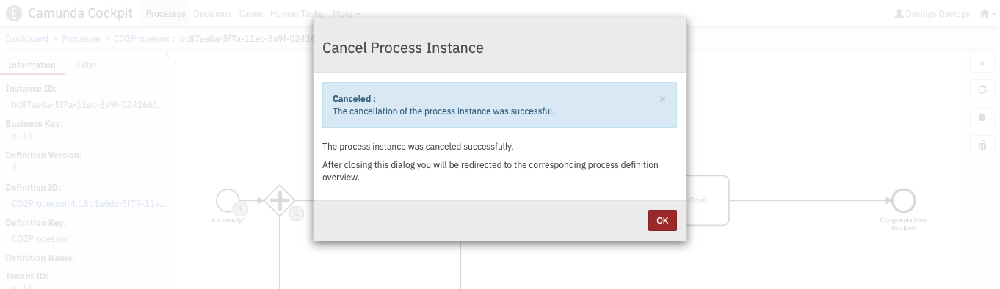

We can then see visual confirmation in the process model that the process, and the associated incident, were indeed canceled.

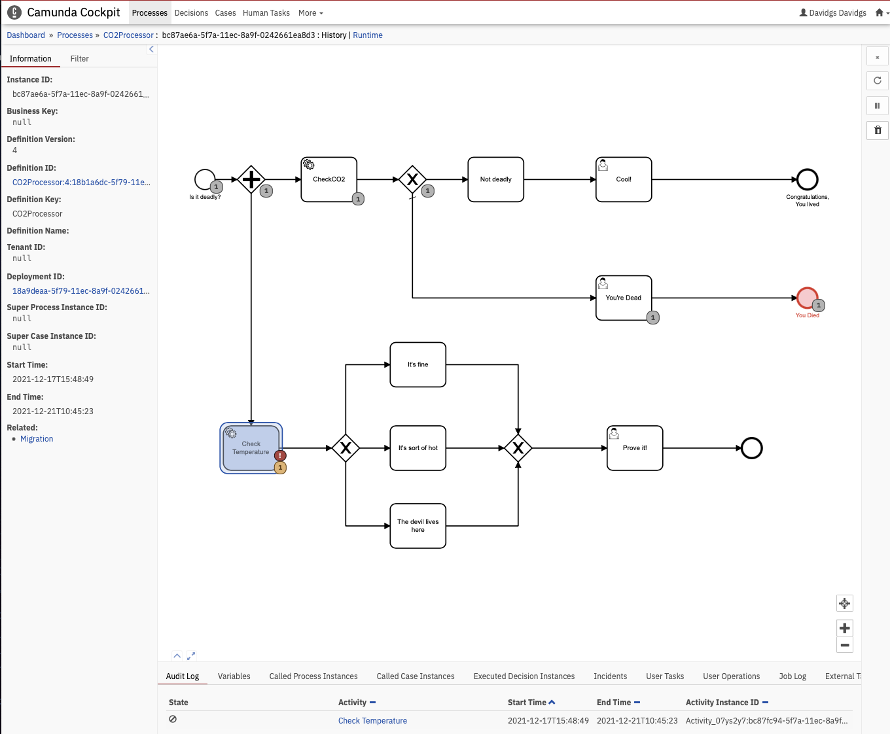

If we've deleted more than one task here the total number of canceled tasks will show up in the process model.

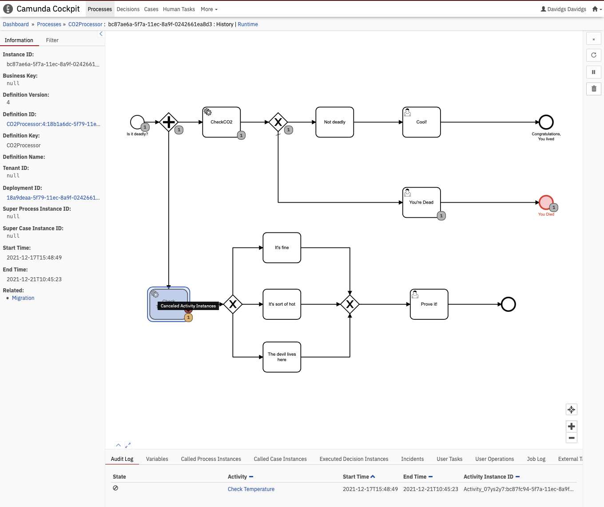

But wait, you say, we were talking about a _Human Task_, not a process task. Correct! But the process for canceling a human task is _exactly_ the same as a process instance.

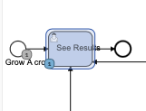

Just locate the human (user) task you want to cancel, and click on the 'Cancel' button.

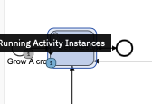

And there you have it, your open Human (User) task is canceled!

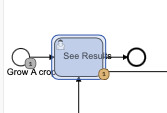