## Question 4

**Single sign-on in Camunda**

### Estimated reading time: 6 minutes, 56 seconds

### The problem:

You've deployed Camunda and successfully run processes there for a while. It's becoming more and more popular, and managing the users via the web Admin app is becoming more cumbersome and time consuming. Single sign-on (SSO) or an external authentication and authorization server seems like a great solution, so how do you make that work?

### The high-level answer:

This is a very popular topic, and one that has about as many answers as you can dream up. Much of this depends on what you plan to use to facilitate your SSO capabilities. We'll explore a few examples here.

The first thing to understand is the Authentication method provided by Camunda. You can read about the [Basic Authentication](https://docs.camunda.org/manual/latest/reference/rest/overview/authentication/) method, which is what most of the solutions are based on.

You can therefore provide your own implementation, add it to the `web.xml` (as described in the basic auth example), and all requests should be authenticated using your implementation.

This only solves the authentication part of the issue, as Authorization details must be provided in Camunda itself (usernames and groups need to exist, etc.) but this is a great starting point.

The Camunda consulting team provides a more complete solution using the Camunda Spring Boot starter with Spring Security. Find this project on the [Camunda Consulting GitHub](https://github.com/camunda-consulting/code/tree/master/snippets/springboot-security-sso).

Likewise, there is also a Camunda [JBoss SSO](https://github.com/camunda/camunda-sso-snippets) example, and a [Keycloak example](https://github.com/camunda/camunda-sso-snippets).

These examples, combined with the [documentation](https://docs.camunda.org/manual/latest/reference/rest/overview/authentication/), can assist in implementing a custom SSO solution.

### The detailed implementation answer

Since practical, hands-on information can be the most useful, let's take a look at how to implement a [Keycloak](https://keycloak.org) user authentication server in front of Camunda. Keycloak is also open source, so it's a perfect complement to Camunda as an authentication server, and you can use it for SSO for a large number of applications.

To get started, download a copy of Keycloak. Use either the regular distribution or the Docker version as either will work for these purposes. This post uses the Keycloak v15.0.2 Wildfly distribution.

Here, we download the distribution and run `standalone.sh` in the `keycloak-15.0.2/bin` directory.

> **Note:** Though I'll show examples using unsecured `http`, I don't recommend authentication over anything but TLS (`https`). You'll be passing usernames and passwords back and forth, and doing that unencrypted is a terrible idea.

By default, Keycloak starts up listening to `http://127.0.0.1:8080/auth`; point your browser there, and you will initially be asked to create the first user, who will be your Admin User.

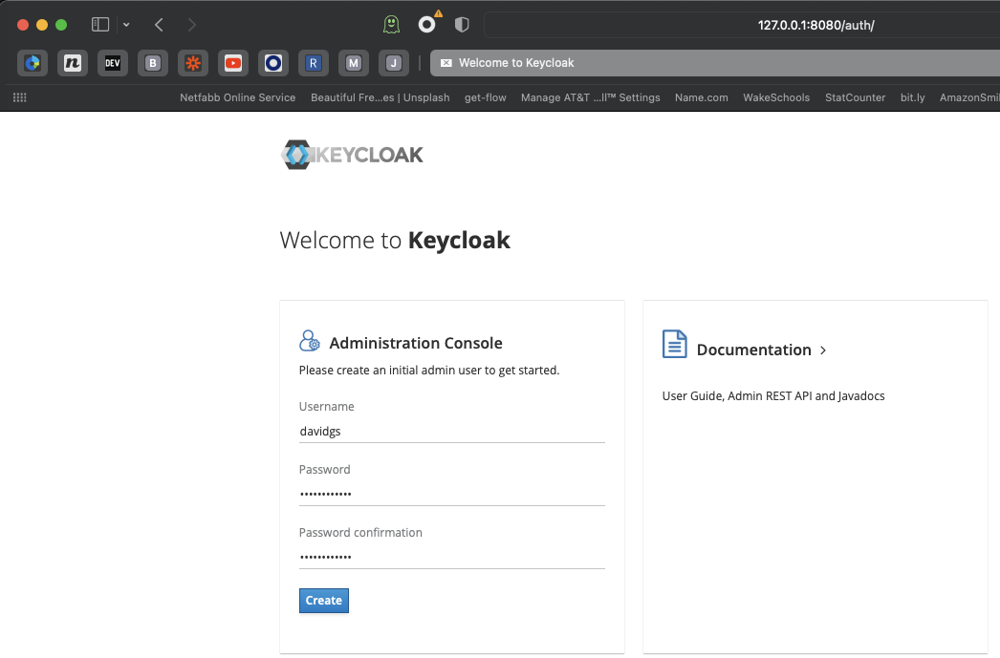

You can then use that new user to log in to the Keycloak Administration page. The first thing you will need to do is create a new realm. You could use the `master` realm, but this is generally considered bad practice.

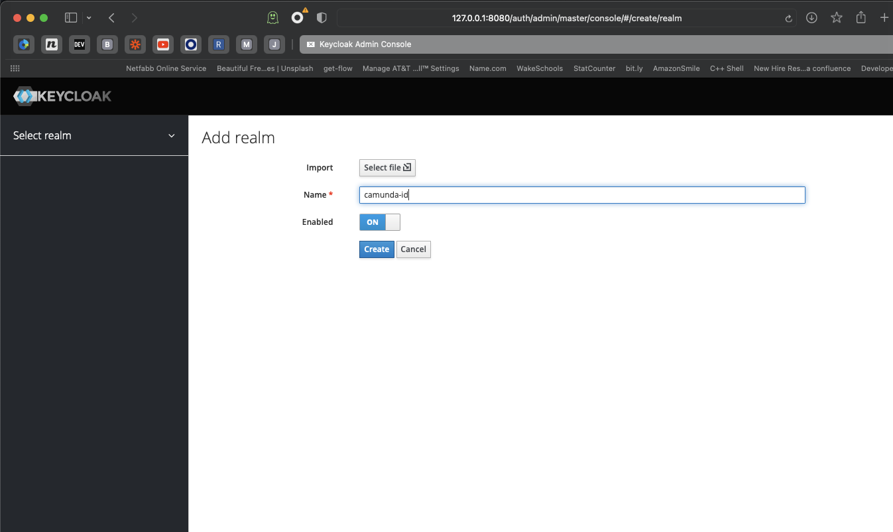

We are going to call our realm `camunda-id`.


Now that you have a new realm, you'll need to create a new client in that realm for the actual authentication to happen. There are a few settings that you *have* to get right or Keycloak will not function correctly. The first is that this server will be using the `confidential` access type.

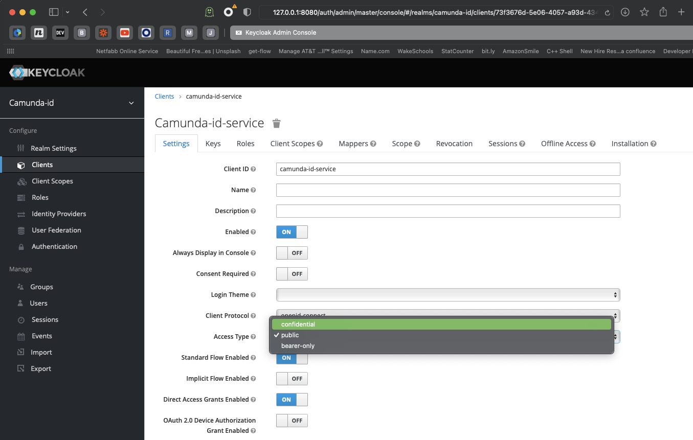

The second one is the Redirect URI. This is where our first dilemma arises. Keycloak is running on port 8080, but that's also the default port for Camunda Platform Run. One of them will have to move. Since we've already started Keycloak on port 8080, we will move Camunda Platform Run to port 8181.

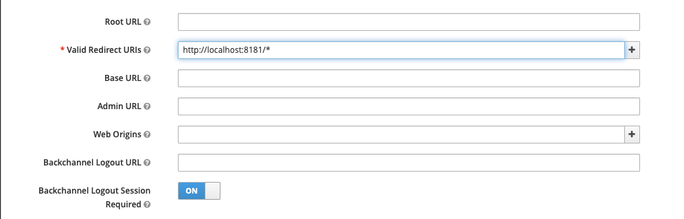

Getting the redirect URI correct is one of the most common problems in getting Keycloak to work as an authentication server.

Next, enable `service accounts` as we will be using these.

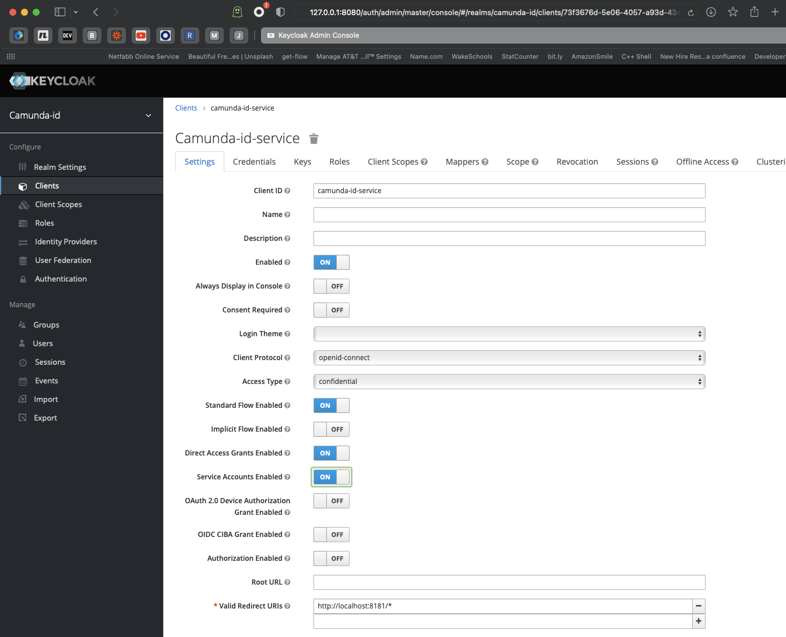

The final setting to pay attention to (since it's not a default setting) is turning on the **Use Refresh Tokens for Client Credentials Grant**. This setting is under the **OpenID Connect Compatibility Mode** submenu. Don't forget to save your configuration!

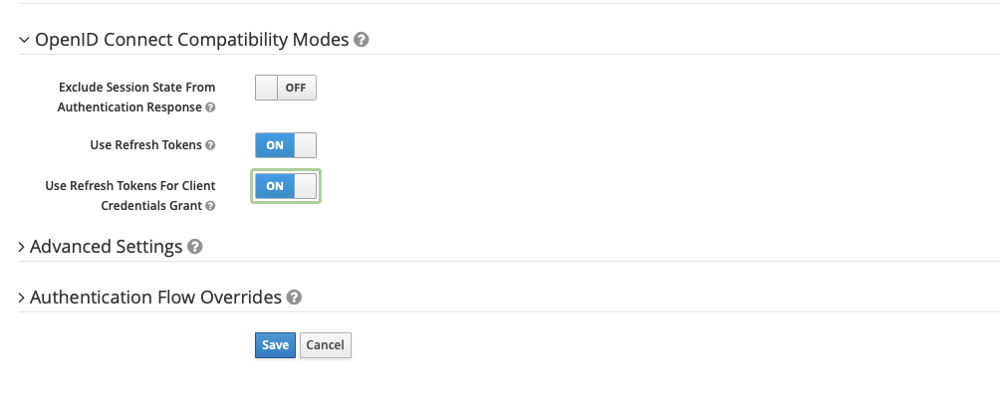

Next we'll create an admin group for our Camunda realm.

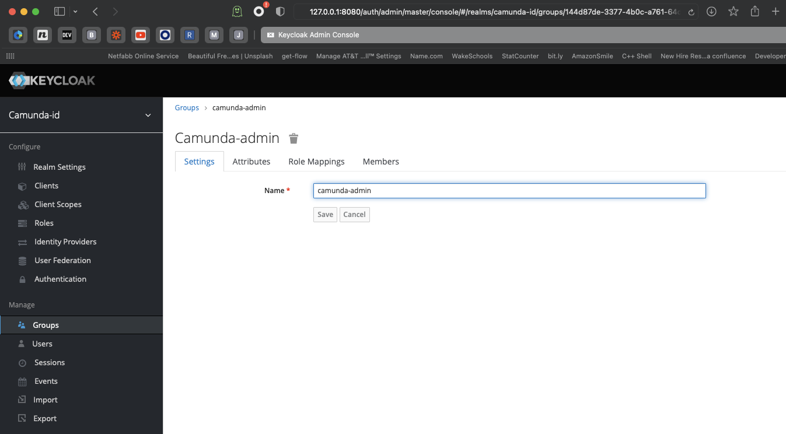

You must assign some roles to the realm client, so click on **Clients** in the sidebar, and note a tab called **Service Account Roles**. This is where we will assign roles.

Under **Client Roles**, select `realm-management` and choose the following available roles: `query-groups`, `query-users`, and `view-users`.

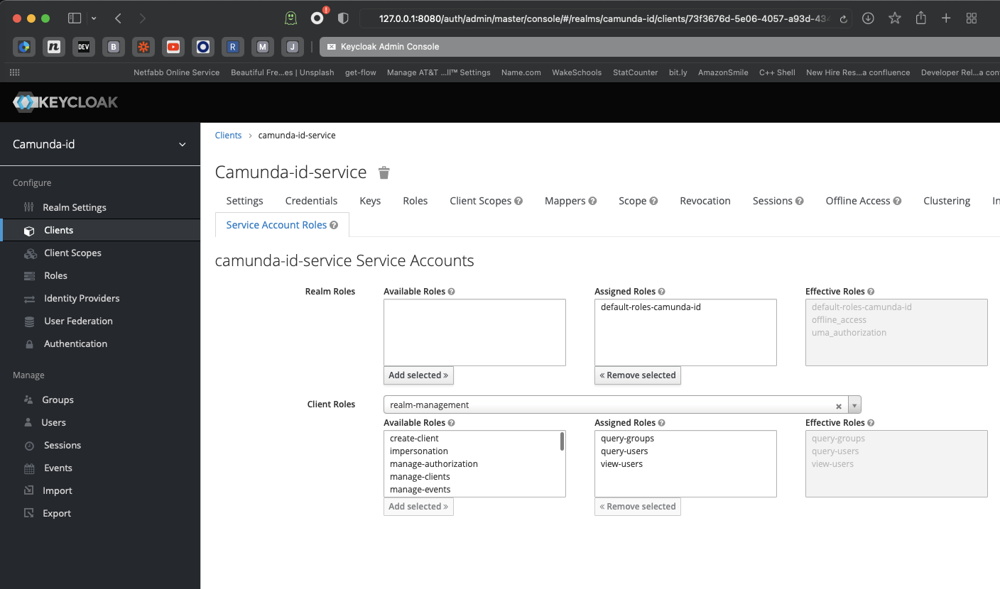

We're almost there, I promise!

Finally, create a user or two who can log in to Camunda Platform. This setup will not enable the "registration" option, so the users should already exist.

### Time to get Camunda Platform running

Now that we have a functioning instance of Keycloak, it's time to get Camunda Platform Run going so we can use the Keycloak service to authenticate.

We use [Camunda Platform Run v7.16.0](https://camunda.com/download/) for this exercise.

Start by editing the `default.yml` file in the `configuration` directory.

Add the following lines:

```
# Camunda Keycloak Identity Provider Plugin
plugin.identity.keycloak:
  keycloakIssuerUrl: http://localhost:8080/auth/realms/camunda-id
  keycloakAdminUrl: http://localhost:8080/auth/admin/realms/camunda-id
  clientId: camunda-id-service
  clientSecret: <copy from your client secret on Keycloak Server>
  useUsernameAsCamundaUserId: true
  useGroupPathAsCamundaGroupId: true
  administratorGroupName: camunda-admin
  disableSSLCertificateValidation: true
```

Find your client secret in the Keycloak Admin interface under **Clients > Credentials**.

While editing your default configuration files, remove the following lines:

```
camunda.bpm:
  admin-user:
    id: demo
    password: demo
```

Here's the complete `default.yml` file:

```
# Find more available configuration properties on the following pages of the documentation.
# https://docs.camunda.org/manual/latest/user-guide/camunda-bpm-run/#configure-camunda-bpm-run
# https://docs.camunda.org/manual/latest/user-guide/spring-boot-integration/configuration/#camunda-engine-properties

run:
# https://docs.camunda.org/manual/latest/user-guide/camunda-bpm-run/#cross-origin-resource-sharing
    cors:
      enabled: true
      allowed-origins: "*"
    auth.enabled: true

server:
  port: 8181

# Camunda Keycloak Identity Provider Plugin
plugin.identity.keycloak:
  keycloakIssuerUrl: http://localhost:8080/auth/realms/camunda-id
  keycloakAdminUrl: http://localhost:8080/auth/admin/realms/camunda-id
  clientId: camunda-id-service
  clientSecret: b9975493-1e13-4ef5-8d09-2a789fe3d1bb
  useUsernameAsCamundaUserId: true
  useGroupPathAsCamundaGroupId: true
  administratorGroupName: camunda-admin
  disableSSLCertificateValidation: true

# datasource configuration is required
spring.datasource:
  url: jdbc:h2:./camunda-h2-default/process-engine;TRACE_LEVEL_FILE=0;DB_CLOSE_ON_EXIT=FALSE
  driver-class-name: org.h2.Driver
  username: sa
  password: sa

# By default, Spring Boot serves static content from any directories called /static or /public or /resources or
# /META-INF/resources in the classpath. To prevent users from accidentally sharing files, this is disabled here by setting static locations to NULL.
# https://docs.spring.io/spring-boot/docs/current/reference/htmlsingle/#boot-features-spring-mvc-static-content
spring.web.resources:
  static-locations: NULL
```

Finally, obtain the extension for the Platform and install it. Get the latest version of the extension at [Maven Central](https://search.maven.org/search?q=g:org.camunda.bpm.extension%20AND%20a:camunda-bpm-identity-keycloak-run). Download the `jar` file and put it in the `userlib` directory, which is also in the `configuration` directory with your `default.yml` file.

If all of that is done, when you start your Camunda Platform instance you should see the following line:

```
KEYCLOAK-01001 PLUGIN KeycloakIdentityProvider$$EnhancerBySpringCGLIB$$5a974bdb activated on process engine default
```

Now, if you try to log in with the default `demo:demo username:password` combination, you'll see the following message:

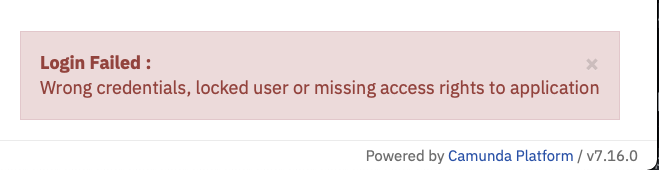

Remember the earlier note that the users must already exist? That's where we are now. Let's head back to our Keycloak Admin interface and create a user.

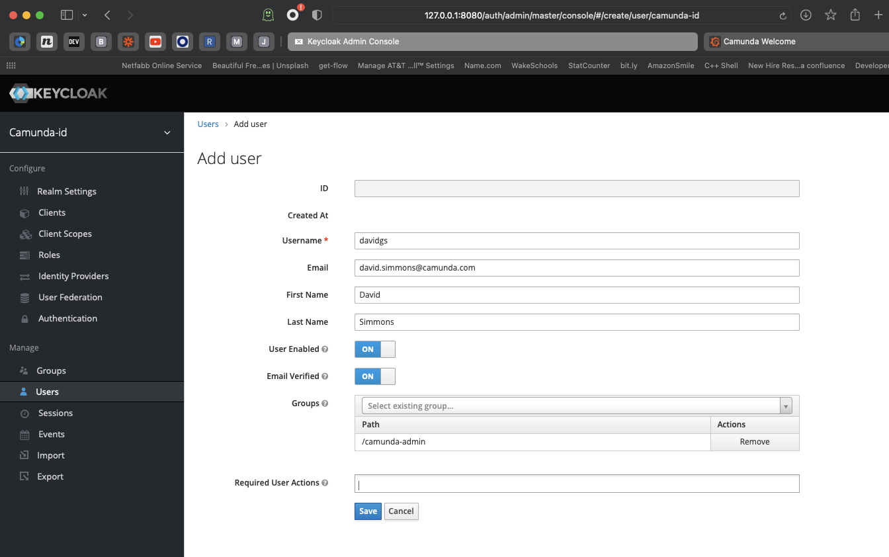

Set their password for good measure. I turned off the `Temporary` flag here so the user won't be forced to reset their password.

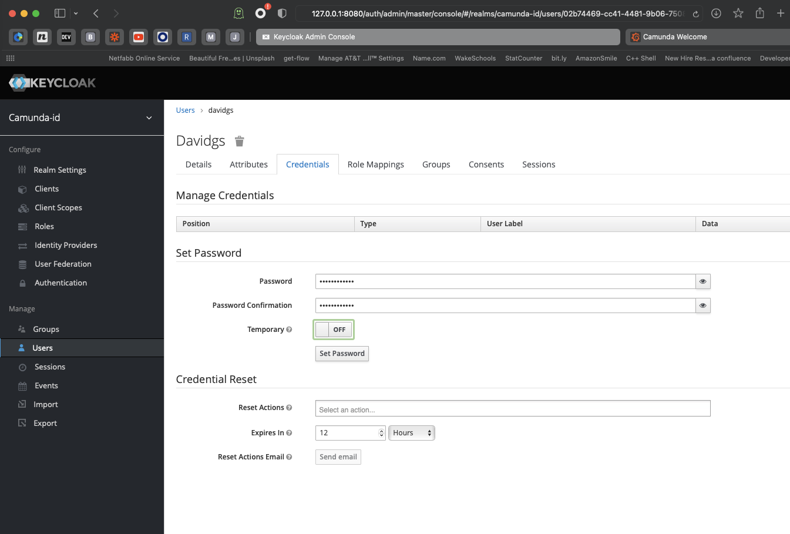

If we go back to the Camunda instance, we can now log in as the newly-created user!

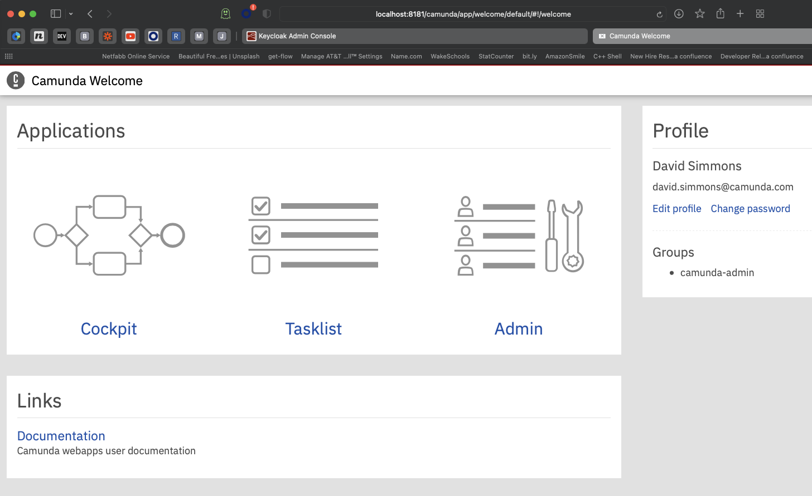

### Bonus configuration

The drawback with this setup, of course, is that users must already exist in Keycloak before they can log in to Camunda Platform. What if we want users to be able to register themselves?

It turns out that's not as hard to manage as you might imagine! First, if we go back to our Keycloak instance and look at our client configuration, we will see that there is an account page enabled. If we go to that page, we can register for a new account.

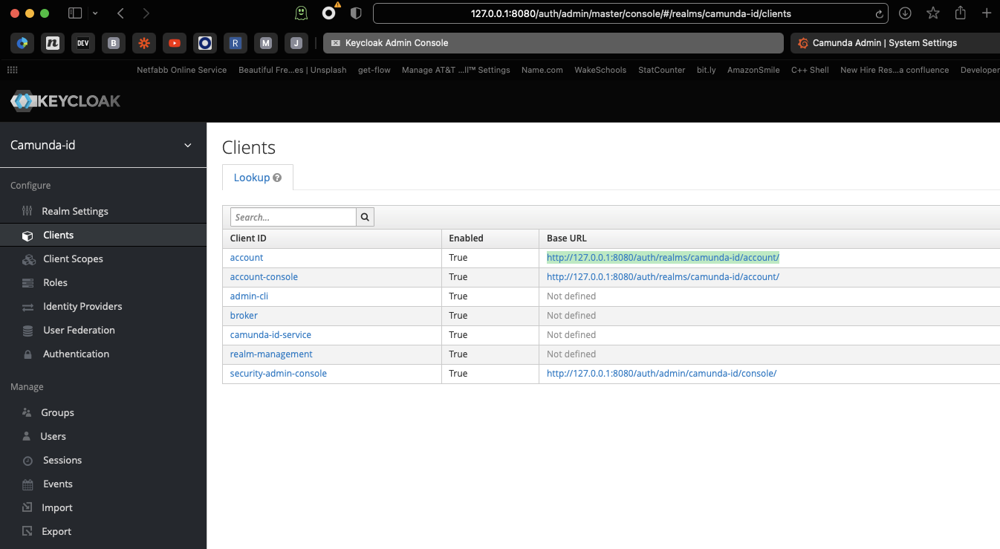

There, you'll also find a page with information about accounts. In the top corner, you'll notice a **Sign in** button which allows you to register a new account.

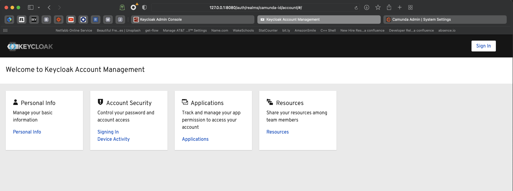

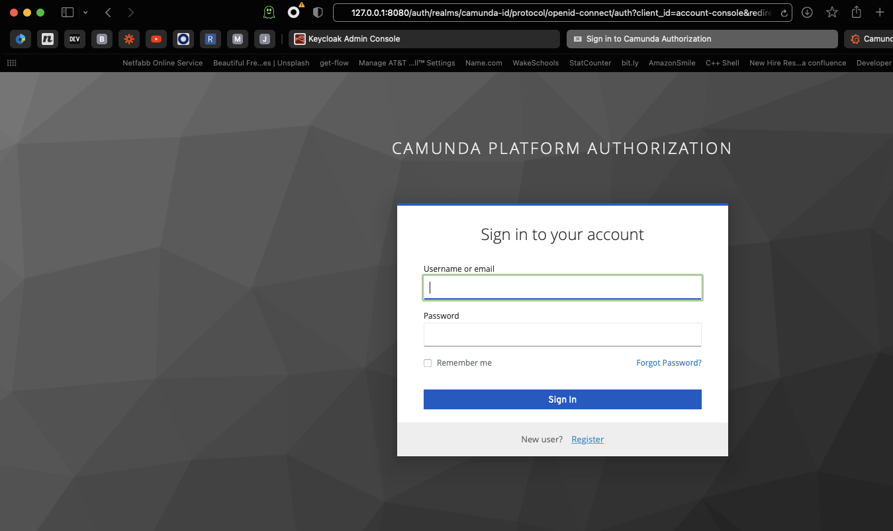

You now have a self-service registration and authorization system for your Camunda Platform instance!
