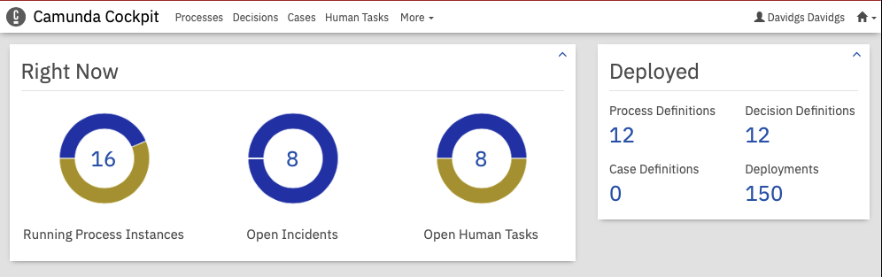
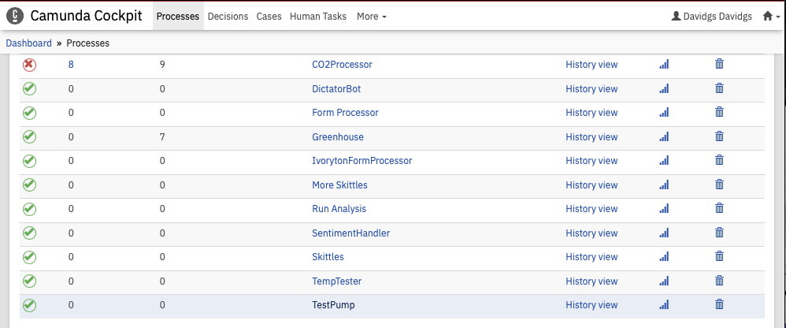
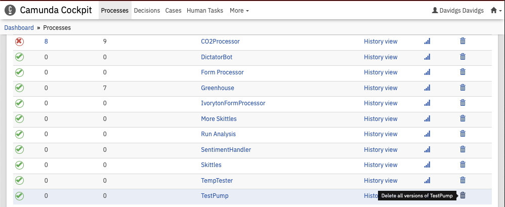
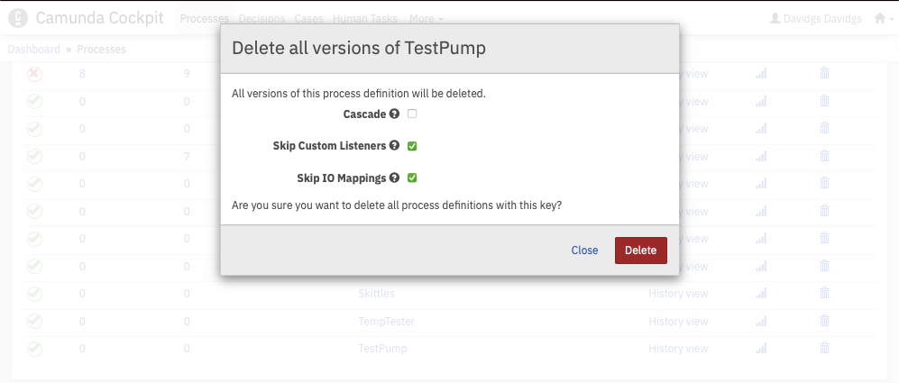
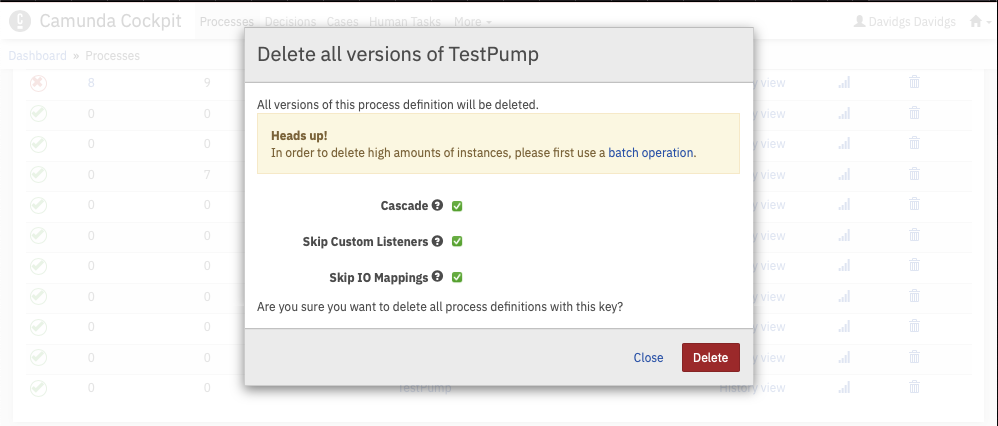
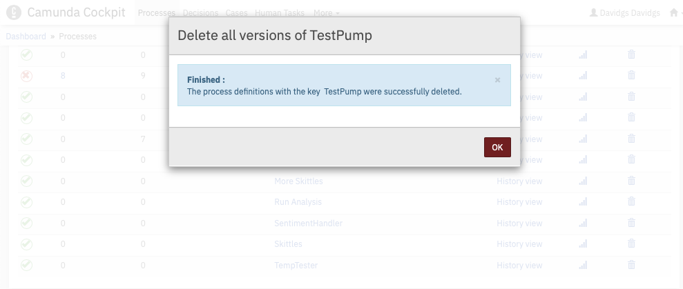
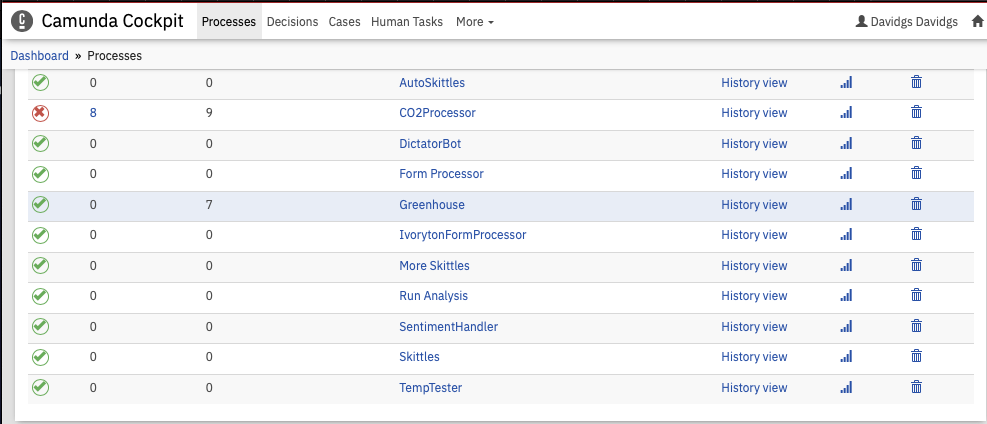

# Q&A The one where you completely remove a process definition

Let's say you're completely done with a certain process definition. You no longer run that process, and it's just cluttering up your deployment, so you want it gone.

First, make _sure_ you want it gone! Once you delete it, it's gone forever and there is no getting it back! If you still have the `.bpmn` file that you originally used to create the process you can re-load that, but all the history, statistics, etc. associated with that process will be gone.

## So you've decided you're done with the process, now what?

Well then, it's time to delete it! Again, let's just check in one more time that you're _sure_, like _really, **really** sure_ that you never want to see this process again.

If you are sure, then let's proceed with deleting it.

## Step by Step Instructions

Login to Cockpit in the Camunda Platform and Look for your Process Definitions:

Click on the Process Definitions to get to the list off all of your process definitions.

Find the Process you want gone, and click on the Trash Can icon on the right-most column.

Click on that Trash Can icon. It's still not too late to change your mind, but it's getting close to the point of no return.

Now it's time to actually start the process of deleting the process. Click the 'Cascade' button, just to be safe. You want to make sure you get everything the first time.

We can safely ignore the "Batch Process" warning message, since of course there are no running instances of the process. Right? RIGHT??!! Of course, because you already said you were no longer using it.

Once you hit the delete button, the process will be permanently and irrevocably deleted. This is your _very last_ chance to turn back.

Now that it's deleted, when you return to your Process list, you will see that the process definition is no longer listed.

And now it's gone. Forever. And no, you can't get it back.

